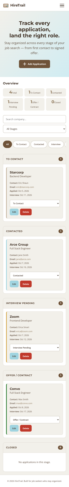
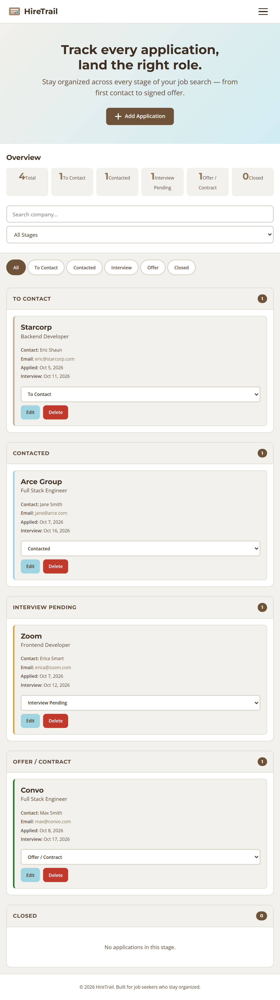
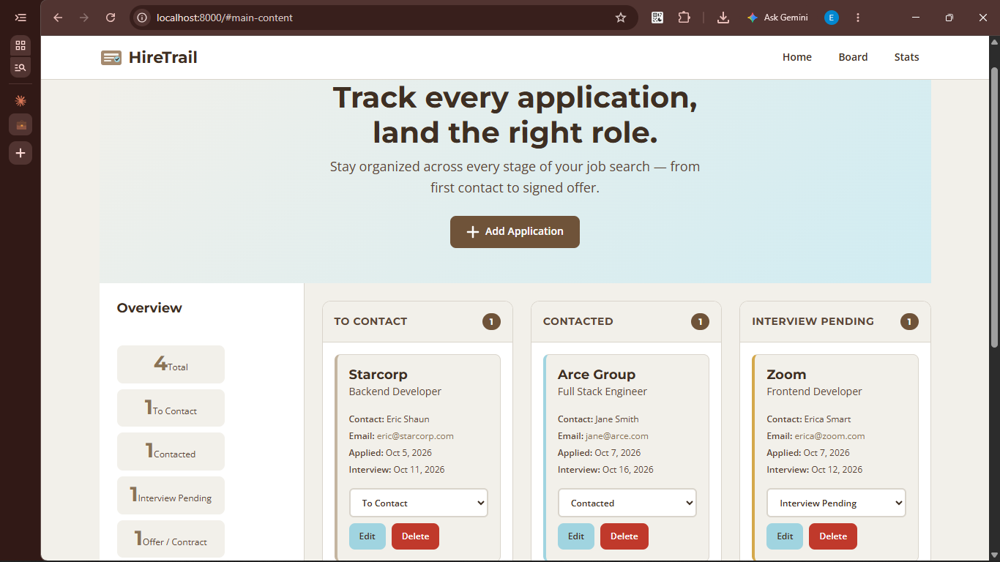
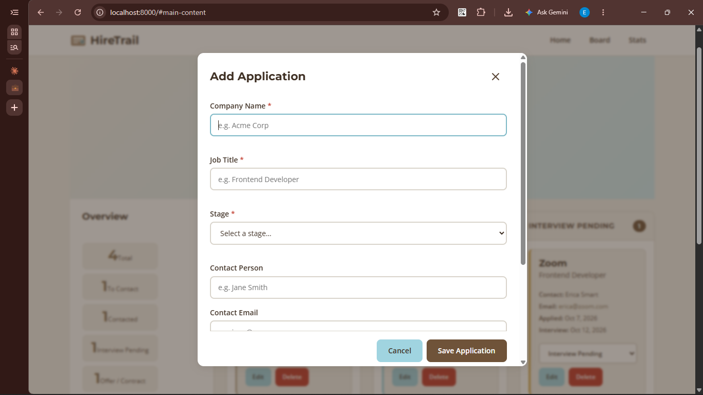

# HireTrail — Job Application Tracker

A responsive, accessible, client-side web application that helps job seekers organize their job applications across five stages: **To Contact**, **Contacted**, **Interview Pending**, **Offer / Contract**, and **Closed**.

Built for Project 1 (Responsive Frontend Interface) of the DecodeLabs Full Stack Development internship, using only HTML5, CSS3 and vanilla JavaScript.

**Live demo:** [add GitHub Pages link here]

---

## Features

- **Add, edit, and delete** job applications with company name, job title, stage, contact person, email, dates, and notes
- **Move applications between stages** via a dropdown on each card — no drag-and-drop required
- **Filter by stage** using sidebar dropdown or mobile-friendly tab bar
- **Search by company name** with debounced input
- **Live stats** showing counts per stage, updated on every change
- **Persistent state** via `localStorage` — data survives page reloads
- **Mobile hamburger menu** with `aria-expanded` toggle, closes on Escape
- **Accessible dialogs** (`<dialog>`) for add/edit and delete confirmation
- **Inline form validation** with `aria-live` error messages
- **Keyboard navigable** end-to-end with visible `:focus-visible` styles
- **Responsive** across 320px → 1440px with zero horizontal overflow

---

## How to Run

1. Clone or download this repository.
2. Open [`index.html`](index.html) in any modern browser (Chrome, Firefox, Edge, Safari).
3. No build step, no dependencies, no server required.

To serve it locally (required for Lighthouse audits, which cannot run on `file://` URLs): run `python -m http.server 8000` inside the project folder and visit `http://localhost:8000`.

```
hiretrail/
├── index.html        ← Open this file
├── css/
│   └── styles.css
├── js/
│   └── app.js
├── assets/
│   └── screenshots/
├── PLAN.md
└── README.md
```

---

## Tech Stack

| Layer | Technology |
|-------|-----------|
| Structure | Semantic HTML5 (`<header>`, `<nav>`, `<main>`, `<section>`, `<article>`, `<aside>`, `<footer>`, `<dialog>`) |
| Styling | CSS3 — Custom Properties, CSS Grid, Flexbox, `clamp()` fluid typography, `min-width` media queries |
| Logic | Vanilla JavaScript (ES6+) — IIFE module pattern, array state, `localStorage`, DOM manipulation |
| Fonts | [Google Fonts](https://fonts.google.com) — Montserrat (headings, weights 600/700) + Open Sans (body, weights 400/600) |
| Icons | Inline SVG (no external icon library) |

**Zero frameworks, zero libraries, zero build tools.**

---

## Design Decisions

### Palette — Warm, Grounded 2025 Aesthetic

| Token | Hex | Role |
|-------|-----|------|
| Mocha Mousse | `#A58A6F` | Decorative accents and borders |
| Dark Mocha | `#6F5339` | Buttons, tabs and badges that carry text (white text on top) |
| Ethereal Blue | `#A0D4E0` | Secondary buttons, focus states, highlights |
| Moonlit Grey | `#F2F0EA` | Page background |
| Dark Brown | `#3E2F23` | Body text |

### Typography

- **Headlines**: Montserrat (600, 700) — geometric, confident
- **Body**: Open Sans (400, 600) — highly readable, neutral
- Fluid scale using `clamp()` — text scales smoothly between mobile and desktop without breakpoint-specific overrides

### Breakpoints

| Breakpoint | Width | Layout |
|-----------|-------|--------|
| Mobile (default) | 0–767px | Single column, hamburger menu, stage tabs, stacked cards |
| Tablet | 768px–1023px | Inline nav, two-column stage grid, side-by-side stats + filters |
| Desktop | 1024px+ | Sticky sidebar + three-column board, tabs hidden |

### Why These Choices

- **CSS Grid for macro layout**: Natural fit for the board + sidebar pattern; `grid-template-columns` switches cleanly at breakpoints
- **Flexbox for micro components**: Nav bars, card rows, button groups — simpler and more predictable than grid for 1D layouts
- **`clamp()` over media-query-based font sizes**: Fewer breakpoints, smoother scaling, less CSS
- **`<dialog>` over custom modal**: Native focus trapping, `::backdrop`, Escape-to-close — all free from the browser
- **IIFE module pattern**: Keeps all state and DOM references private; no global namespace pollution

---

## Accessibility Notes

- **Skip-to-content link** as the first focusable element
- **Semantic landmarks**: `<header>`, `<nav>`, `<main>`, `<aside>`, `<footer>`, `<section>`, `<article>`
- **Single `<h1>`** with logical heading hierarchy (h1 → h2 → h3 → h4)
- **All inputs have visible `<label>`s**; search/filter inputs use `sr-only` labels (visible nearby context makes them redundant)
- **`aria-expanded`** on hamburger menu, **`aria-selected`** on stage tabs
- **`aria-live="polite"`** on stats grid, **`aria-live="assertive"`** on form field errors
- **`aria-invalid`** toggled on fields with validation errors
- **`role="tablist"` / `role="tab"`** on the mobile stage tab bar
- **Minimum 44×44px touch targets** on all interactive elements
- **`prefers-reduced-motion`** respected — all animations/transitions disabled
- **`<meta name="viewport">`** with `width=device-width, initial-scale=1.0`
- **Descriptive `<title>` and meta description**

### Contrast Verification

All text/background pairs meet **WCAG AA (4.5:1)** minimum. Ratios were verified with WebAIM's Contrast Checker
| Foreground | Background | Ratio | Level | Where Used |
|-----------|-----------|-------|-------|------------|
| `#3E2F23` | `#F2F0EA` | 11.26:1 | AAA | Body text on page background |
| `#3E2F23` | `#FFFFFF` | 12.83:1 | AAA | Text on cards, header, inputs |
| `#3E2F23` | `#A0D4E0` | 7.94:1 | AAA | Text on secondary buttons |
| `#3E2F23` | `#D0ECF2` | 10.37:1 | AAA | Nav link hover background |
| `#FFFFFF` | `#6F5339` | 7.06:1 | AAA | Primary button, active tab, count badge |
| `#FFFFFF` | `#5A3D2E` | 7.06:1 | AAA | Primary button hover |
| `#FFFFFF` | `#C0392B` | 5.43:1 | AA | Danger/delete button |
| `#5A4636` | `#F2F0EA` | 7.79:1 | AAA | Muted text, footer, card meta on page bg |
| `#5A4636` | `#FFFFFF` | 8.88:1 | AAA | Muted text on white cards/inputs |

---

## Testing

### Breakpoints Verified

| Width | Device | Layout | Status |
|-------|--------|--------|--------|
| 320px | Small phone | Single column, hamburger menu, stage tabs | ✅ No overflow |
| 375px | Medium phone | Single column, hamburger menu, stage tabs | ✅ No overflow |
| 768px | Tablet | Inline nav, two-column stage grid | ✅ No overflow |
| 1024px | Desktop | Sidebar + auto-fit board grid | ✅ No overflow |
| 1440px | Large desktop | Sidebar + auto-fit board grid (fills width) | ✅ No overflow |

### Manual Testing

- ✅ Create a new application with all fields filled
- ✅ Edit an existing application and verify changes persist
- ✅ Move an application between stages using the card dropdown
- ✅ Delete an application with confirmation dialog
- ✅ Refresh the page and confirm data persists (localStorage)
- ✅ Submit empty form — inline validation errors appear
- ✅ Enter invalid email — email format error shown
- ✅ Search by company name filters the board in real time
- ✅ Stage filter dropdown and tab bar both work
- ✅ Keyboard-only navigation: Tab through all controls, Enter/Space to activate, Escape to close
- ✅ Layouts checked at 320, 375, 768, 1024 and 1440px — no horizontal scrolling

### Lighthouse

Tested on localhost, in Incognito, 3 runs each, with no other apps running.

| Device | Performance | Accessibility | Best Practices | SEO |
|---|---|---|---|---|
| Desktop | 100 | 100 | 100 | 100 |
| Mobile (simulated 4× CPU throttle) | 89–98 (median 94) | 100 | 96–100 | 100 |

> Mobile Performance varies between runs because Lighthouse's mobile simulation is sensitive to machine load.

---

## Screenshots

| Viewport | Screenshot |
|----------|-------------|
| Mobile (375px) |  |
| Tablet (768px) |  |
| Desktop (1280px+) |  |
|Application dialog |  |
---

## Known Limitations

- Data is stored only in the browser's `localStorage` (single user, no sync between devices)
- No data export or import
- No drag-and-drop between stages (stage changes use a dropdown)
- No interview reminders or notifications
- Four font weights are used across two families, one more than the brief's 3-weight guideline

---

## License

This project was built as part of a DecodeLabs Full Stack internship assignment. Free to use and modify.

---

## Author

Bamigbaye Opeyemi, Full Stack Development Intern at DecodeLabs.